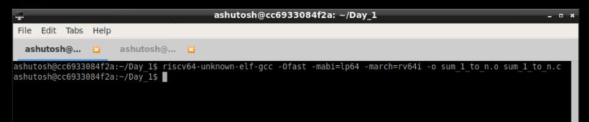
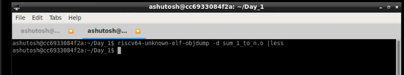
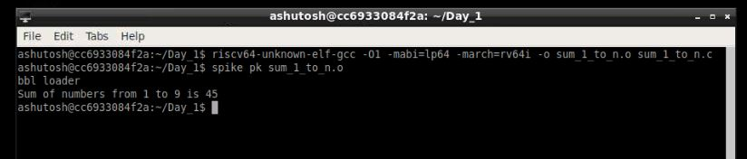
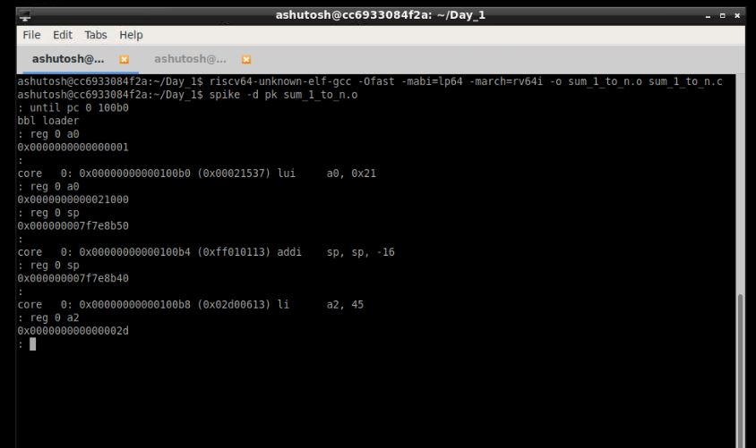
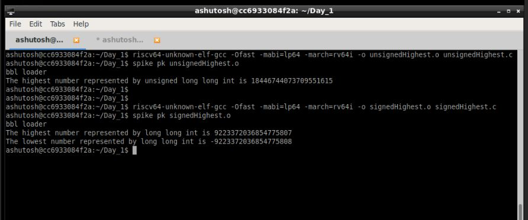

# Day 1 : Introduction to RISC-V ISA and GNU compiler toolchain

## DAY 1 Contents
Day 1 of the workshop included the following:

     1. Introduction to RISC-V basic keywords
     2. Labwork for RISC-V software toolchain
     3. Integer number representation
     4. Signed and unsigned arithmetic operations
     
 
Day_1 started with an introductory session by @Kunalghosh and @Stevehoover. They briefed us about the entire wokshop flow. We were made familiar with the VSD-IAT platform and using the lab instances . 

A brief overview of how the higher level languages are converted to assembly and then into machine/binary format, and then finally how it gets comverted into a chip layout was given in a hierarchical manner. We were introduced to RISC-V ISA and GNU Compiler Toolchain. We were made familiar with the various types of RISC-V instructions sets, such as:
  
  - **RV64I** or RV32I Base integer instructions: 64 and 32 bit data instructions respectively
  - **RV64M** i.e Multiply extension
  - **RV64IM** : Includes base and multiple extension.
  - **RV64F** and **RV64D** : Floating point and Double extenstion. 
  
Additionally we learnt about the signed and unsigned integer number representation and their maximum and minimum ranges for a 64bit instruction set.
  
  - Integer: 
    - Word i.e. 32 bits.
    - Double word i.e 64 bits
    - RV64 has range 0 to (264 - 1)
    
  - Negative i.e signed numbers:
    - Range is - 263 to (263 - 1)
    
    The instructions which work on these numbers are called Base Integer Instruction **RV64I**.
    
    A CPU core implementing all the above type of instrcutions is called as **RV64IMFD** CPU Core.
    
 
# Lab Exercises
 
## Lab 1 : C program of to find the Sum of numbers from 1 to n

A basic C program to calculate sum of natural numbers upto a limit provided by the user. The code can be found [here](https://github.com/RISCV-MYTH-WORKSHOP/RISC-V-CPU-Core-using-TL-Verilog/blob/master/Day_1/Codes/sum_1_to_n.c) 

## List of commands
### For compiling using GNU toolchain

1. Open a file named sum_1_to_n. using leafpad editor.  
     `$leafpad sum_1_to_n.c`   
2. Write your C code for sum of numbers from 1 to  n (say n =9).
3. Compile using GNU compiler.   
    ` $gcc sum_1_to_n.c`   
4. Run the compiled object file (Default object file formed with the name a.out).
     `$./a/out`
     

## Lab 2 : Using RISC-V compiler toolchain, and code disassamble ans spike simulator.
  The same C program is now compiled using RISC-V toolchain. Spike simulator is used to run the object file , and aslo as a debugger.  
  
## List of commands
  
### For compiling using RISC-V simulator

1. Since we have previously created our sum_1_to_n.c program file, now to run the same program using RISC-V simulator:

   `$riscv64-unknown-elf-gcc -Ofast -mabi=lp64 -march=rv64i -o sum_1_to_n.o sum_1_to_n.c`
   
    **Command info:** riscv64-unknown-elf-gcc => RISC-V compiler  , -Ofast => Compiler option (Various compiler options like -O1, -o1, -Ofast)  , -mabi=lp64 => ABI of long int pointer  , -march=rv64i => architecture-64bit , -o => output ,  sum_1_to_n.o => object file , sum_1_to_n.c => C program file
    
    
    
2. In order to see what is the assembly code for the C program that we are running,i.e to see the disassembled file, we run the following in a new tab in the terminal:

   `$riscv64-unknown-elf-objdump -d sum_1_to_n.o | less`
   

3. When the objdump file opens, type **/main** (since we are interested in the main program of the code, and press n to go to next instantiation of main in the file).

**Objdump file using -Ofast:**

**Objdump file using -O1:**

There are different compiler options like **-O1, -Ofast** and all. Here, in case of -Ofast, we are getting the number of instructions as 12. If we use the -O1 compiler option, then the number of instructions would be 15 for the "**/main"** program. Thus from this we infered that the number of instructions can be decreased by using -Ofast instead of -O1 during compilation.

4. For running the object file compiled by RISC-V compiler, we are using the spike simulator.
   `$spike pk sum_1_to_n.o`
   

### For debugging using RISC-V simulator

1. In order to debug all the assembly set instructions, we do it with the spike debugger. 

   `$spike -d pk sum_1_to_n.o`
   
2. In a parallel new tab in the terminal, we open the objdump file , and look out for the address location of the pc (say for main program or any part of the program that we want).

3. After the spike debugger opens, type :

   `:until pc 0 100b0` , where 100b0 is the address location from where we start debugging.
   
   `:reg 0 a0`  , To see the contents of the register a0.
   
   Press enter to execute the next set of assembly code instructions.
   

   
  
## Lab 3 : To find the Max and Min unsigned and signed number representations. 

A C program is implemented to show the maximum and minimum unsigned and signed number representations for a RV64I instruction. The code can be found [here](https://github.com/iamrk-vlsi/RISC-V-MYTH-Workshop/tree/master/DAY1/unsignedHighest.c) 
  - Commands used are same as Lab 2
  
   
## Final Output Results for Day_1 of the Workshop

1. Sum of numbers from 1 to n (n=9).

2. To find the maximum and minimumm number that can be represented using 64-bit unnsigned and signed integer number reperesentation.

