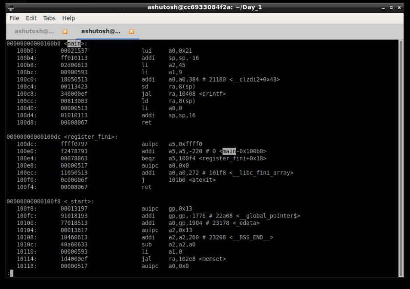

# Day 1 : Introduction to RISC-V ISA and GNU compiler toolchain

Day 1 of the workshop included the following:
     
     1. Introduction to RISC-V basic keywords
     2. Labwork for RISC-V software toolchain
     3. Integer number representation
     4. Signed and unsigned arithmetic operations
     
    
## List of commands
### For compiling using GNU toolchain

1. Open a file named sum_1_to_n. using leafpad editor.  
     `$leafpad sum_1_to_n.c`   
2. Write your C code for sum of numbers from 1 to  n (say n =9).
3. Compile using GNU compiler.   
    ` $gcc sum_1_to_n.c`   
4. Run the compiled object file (Default object file formed with the name a.out).
     `$./a/out`

### For compiling using RISC-V simulator

1. Since we have previously created our sum_1_to_n.c program file, now to run the same program using RISC-V simulator:

   `$riscv64-unknown-elf-gcc -Ofast -mabi=lp64 -march=rv64i -o sum_1_to_n.o sum_1_to_n.c`
   
    **Command info:** riscv64-unknown-elf-gcc => RISC-V compiler  , -Ofast => Compiler option (Various compiler options like -O1, -o1, -Ofast)  , -mabi=lp64 => ABI of long int pointer  , -march=rv64i => architecture-64bit , -o => output ,  sum_1_to_n.o => object file , sum_1_to_n.c => C program file
    
    
    
2. In order to see what is the assembly code for the C program that we are running, we run the follwing in a new tab in the terminal:

   `$riscv64-unknown-elf-objdump -d sum_1_to_n.o | less`
   

3. When the objdump file opens, type **/main** (since we are interested in the main program of the code, and press n to go to next instantiation of main in the file).

4. For running the object file compiled by RISC-V compiler, we are using the spike simulator.
   `$spike pk sum_1_to_n.o`
   

### For debugging using RISC-V simulator

1. In order to debug all the assembly set instructions, we do it with the spike debugger. 

   `$spike -d pk sum_1_to_n.o`
   
2. In a parallel new tab in the terminal, we open the objdump file , and look out for the address location of the pc (say for main program or any part of the program that we want).

3. After the spike debugger opens, type :

   `:until pc 0 100b0` , where 100b0 is the address location from where we start debugging.
   
   `:reg 0 a0`  , To see the contents of the register a0.
   
   Press enter to execute the next set of assembly code instructions.
   

   
   
