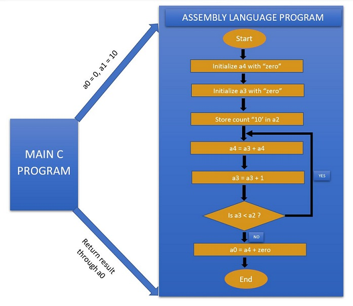
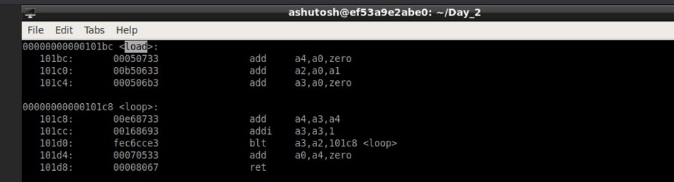

# Day 2: Introduction to ABI and basic verification flow

## DAY 2 of the Workshop Contents
Day 2 of the workshop included the following:

    1. Application Binary interface (ABI)
    2. Lab work using ABI function calls
    3. Basic verification flow using iverilog

## Documentation
We try to implement the same program "sum of numbers from 1 to n" in a different method by taking the advantage of ABI interface and function calls.
1. There is the main C program containing the code for the summation of numbers from 1 to n.
2. We modify it and through the C program we make some funtion calls to the Assembly Language Program trhough the registers a0 and a1.
3. We write the assembly language program in thr ROSC-V ISA and do the computation.
4. Finally we send back the final results through the register a0 to the C pogram to get the final output. 

**Complete Algorithm Flowchart for running the C program using Assmbly language**

**Snapshot of Modified custom C prorgram and "load.S" Assembly language program**

### List of Commands

1. Write the modified custom C code.
`$leafpad 1to9_custom.c`

2. Write the assembly language code for summation of numbers from 1 to n using RISC-V ISA.
`$leadpad load.S`

3. To compile the C code and assembly lang code using riscv compiler:
`$riscv64-unknown-elf-gcc -Ofast -mabi=lp64 -march=rv64i -o 1to9_custom.o 1to9_custom.c load.S`

4. To compile and debug using spike:
`$spike -d pk 1to9_custom.o`

5. To check for the assembly language output file:
`$riscv64-unknown-elf-objdump -d 1to9_custom.c |less`

For Main program:

 
For loop :

