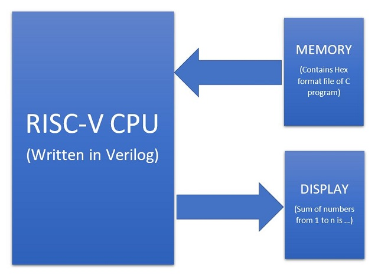
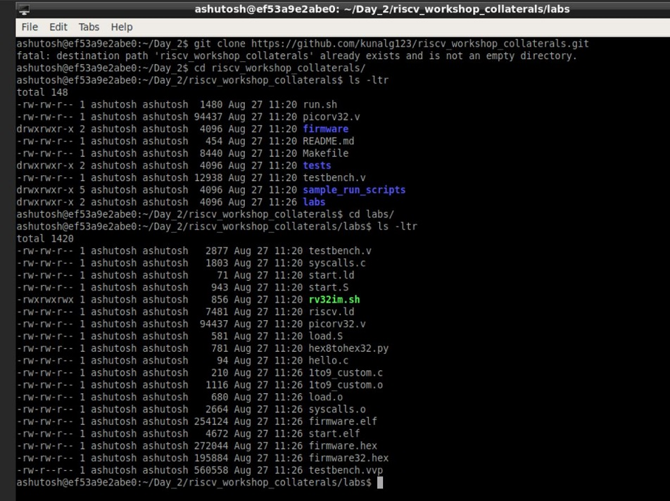
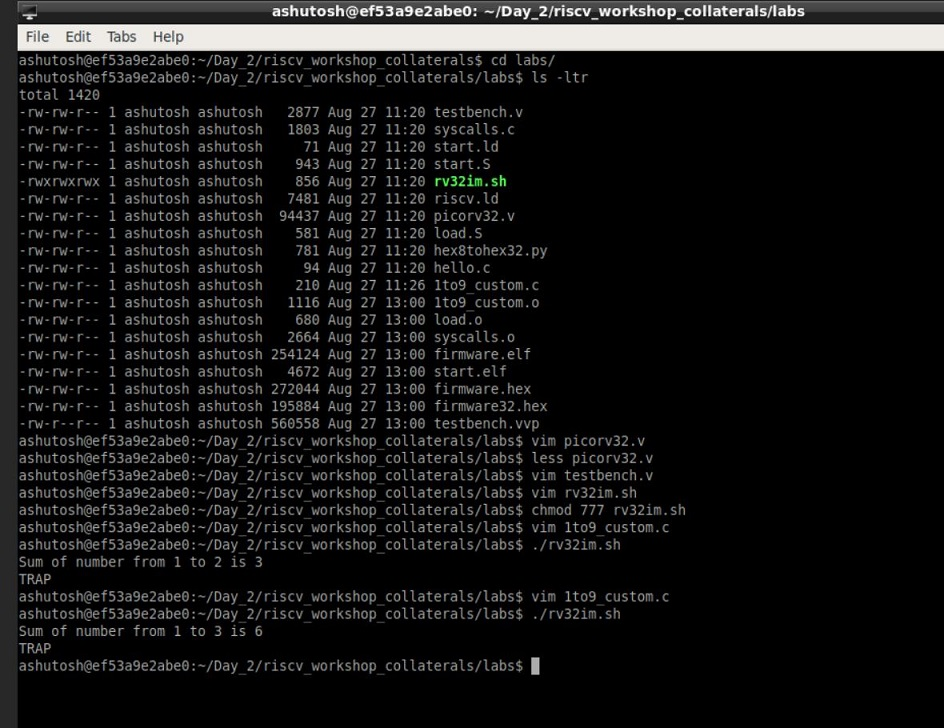

# Day 2: Introduction to ABI and basic verification flow

## DAY 2 of the Workshop Contents
Day 2 of the workshop included the following:

    1. Application Binary interface (ABI)
    2. Lab work using ABI function calls
    3. Basic verification flow using iverilog

## Documentation
We try to implement the same program "sum of numbers from 1 to n" in a different method by taking the advantage of ABI interface and function calls.
- There is the main C program containing the code for the summation of numbers from 1 to n.
- We modify it and through the C program we make some funtion calls to the Assembly Language Program trhough the registers a0 and a1.
- We write the assembly language program in thr ROSC-V ISA and do the computation.
- Finally we send back the final results through the register a0 to the C pogram to get the final output. 

**Complete Algorithm Flowchart for running the C program using Assmbly language**

**Snapshot of Modified custom C prorgram and "load.S" Assembly language program**

On This day, we delved deep into the lower layers on how the higher layer instructions in c are translated to machine understandable codes. 
  Just like how application program interface (API) is used by application programs to access the standard libraries, an application binary interface or system     call interface is utilised hardware resources . The ISA is inherently divided into two parts: *User & System ISA* and *User ISA*  the latter is available to the   user directly by system calls. 
  
  Now, how does the ABI access the hardware resources? 
  - It uses different registers(32 in number) which are each of width `XLEN = 32 bit` for RV32 (~`XLEN = 64 for RV64`) . On a higher level of abstraction these       registers are accessed by their respective ABI names.
  
  For base integer instructions there are broadly 3 types of of such registers:
  - I-type : For instructions having immediate values as operands.
  - R-type : For instructions having only registers as operands.
  - S-type : For instructions used for storing operations.
  
## Lab 1 : ASM & ABI function Calls
  A new program is made by modifying the original `sum1ton.c` and adding ASM and ABI function call .The code can be found [here](https://github.com/iamrk-vlsi/RISC-V-MYTH-Workshop/tree/master/DAY2/Day2_lab1)
  - Command used to compile the program is `riscv64-unknown-elf-gcc -Ofast -mabi=lp64 -march=rv64i -o 1to9_custom.o 1to9_custom.c load.S`. 
  - To view to disassemble and view the object file in readable format, we use `riscv64-unknown-elf-objdump -d 1to9_custom.o|less`.
  - To run we use spike which is a RISC-V simulator, following is the command `spike pk 1to9_custom.o`.
  
  **Output on console**

## Lab 2 : To run and verify on a RISC-V Core
  An RTL implementation of a RISC-V core has been provided to us and we run the above program using the scripts provided to using iverilog simulator, just to observe  the behaviour of the program in hardware. A similar core would be implemented by us in the forthcoming days.
  
  **Output on console**
  

### List of Commands

1. Write the modified custom C code.
`$leafpad 1to9_custom.c`

2. Write the assembly language code for summation of numbers from 1 to n using RISC-V ISA.
`$leadpad load.S`

3. To compile the C code and assembly lang code using riscv compiler:
`$riscv64-unknown-elf-gcc -Ofast -mabi=lp64 -march=rv64i -o 1to9_custom.o 1to9_custom.c load.S`

4. To compile and debug using spike:
`$spike -d pk 1to9_custom.o`

5. To check for the assembly language output file:
`$riscv64-unknown-elf-objdump -d 1to9_custom.c |less`

**For Main program:**

 
**For loop:**

## How do we run the same program on RISC-V CPU

This section contains sample program already written just to show the flow of how to run a program on a RISC-V CPU core.
- We have a RISC-V CPU core written in Verilog and an already written testbench code for the same.
- The entire C program will be converted into a hex format and and will be loaded into memory.
- The CPU will then read the contents of the memory, process it and finally display the output result of sum of numbers from 1 to n.

**Block Diagram to run C program on RISC-V CPU**

### List of Commands:
1. We clone the RISC-V workshop collaterals repository into our local machine:
`$git clone https://github.com/kunalg123/riscv_workshop_collaterals.git`

2. After downloading is complete, move inside the directory.
`$cd riscv_workshop_collaterals`

3. Move to the labs folder.
`$cd labs`

4. To list the contents of the directory, type : 
`$ls -ltr`

 

5. To view the RISC-V CPU code (for picorv32) written in Verilog :
`$vim picorv32.v` .  This contains the entire verilog netlist.

6. To view the testbench file:
`$vim testbench.v` .  This is where we read the hexfile. Scroll down to see the line : **$readmemh("firmware.hex",memory)**

7. To view the standard script of how do we create the hex file :
`$vim rv32im.sh` .  This file contains basically all the necessary set of scripts required to convert the C and Assembly code into hex file and load it into the memory, and then run it. 

8. In order to run this shell script file, we have to change the read/write/execute permissions.
`$chmod 777 rv32im.sh`

9. To run the  script file, type :
`./rv32im.sh`

10. To view the internals of the firmware hex files:
For 64-bit : `$vim firmware.hex`
For 32-bit : `$vim firmware32.hex`  

These files shows how the application software is converted into bitstreams and this firmware file is loaded into the memory through the testbench. This file is then processed by the RISC-V core and finally it displays the output results.

### Final Output snap of Day_3

