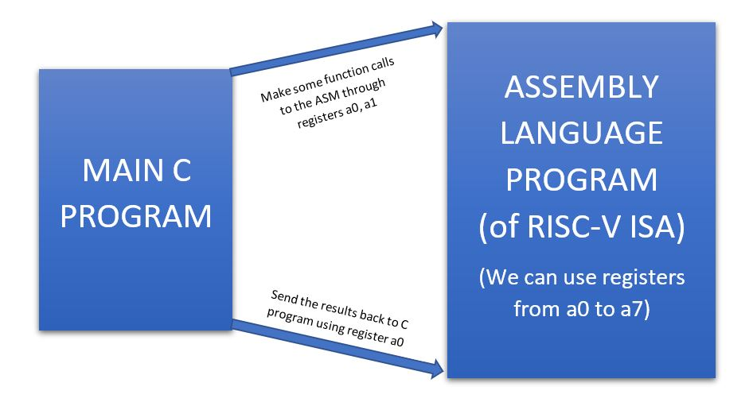

# Day 2: Introduction to ABI and basic verification flow

## DAY 2 of the Workshop Contents
Day 2 of the workshop included the following:

    1. Application Binary interface (ABI)
    2. Lab work using ABI function calls
    3. Basic verification flow using iverilog

We try to implement the same program "sum of numbers from 1 to n" in a different method by taking the advantage of ABI interface and function calls.
1. There is the main C program containing the code for the summation of numbers from 1 to n.
2. We modify it and through the C program we make some funtion calls to the Assembly Language Program trhough the registers a0 and a1.
3. We write the assembly language program in thr ROSC-V ISA and do the computation.
4. Finally we send back the final results through the register a0 to the C pogram to get the final output. 

**Complete Algorithm Flowchart for running the C program using Assmbly language**

**Snapshot of Modified custom C prorgram and "load.S" Assembly language program**

