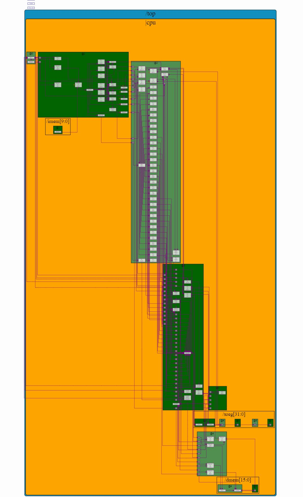

# RISC-V_MYTH_Workshop

This repository contains all the information regarding the 5-day RISC-V based CPU Core Design MYTH (Microprocessor for You in Thirty Hours) Workshop, offered by for VLSI System Design (VSD) and Redwood EDA. The RISC-V CPU Core has been designed using Transaction Level Verilog(TL-Verilog) in addition with the Makerchip Platform. Find below the accompanying details.

Check the folders for assignments for particular days.

# Introduction to RISC-V ISA

RISC-V is an open standard instruction set architecture based on established reduced instruction set computer(RISC) principles. It was first started by Prof. Krste Asanović and graduate students Yunsup Lee and Andrew Waterman in May 2010 as part of the Parallel Computing Laboratory, at UC Berkeley. Unlike most other ISA designs, the RISC-V ISA is provided under open source licenses that do not require fees to use, which provides it a huge edge over other commercially available ISAs. It is a simple, stable, small standard base ISA with extensible ISA support, that has been redefining the flexibility, scalability, extensibility, and modularity of chip designs. This has made it easier and flexible for anyone to build a processor on his own at almost zero cost. 

## What’s Different About RISC-V?**

Comparing to ARM and X86, RISC-V has below advantages:

  - Free: RISC-V is open-source, there is no need to pay for the IP.
  - Simple: RISC-V is far smaller than other commercial ISAs.
  - Modular: RISC-V has a small standard base ISA, with multiple standard extensions.
  - Stable: Base and first standard extensions are already frozen. There is no need to worry about major updates.
  - Extensibility: Specific functions can be added based on extensions. There are many more extensions are under development, such as Vector.

## ISA base and extensions

The RISC-V instruction set has modular characteristics. The instruction set is organized in a modular manner.Each module is represented by an English letter. 
The instruction set includes the standard part and the extension part. The standard part must be implemented.

The ISA base and its extensions are developed in a collective effort between industry, the research community and educational institutions. The base specifies instructions (and their encoding), control flow, registers (and their sizes), memory and addressing, logic (i.e., integer) manipulation, and ancillaries. 
The standard extensions are specified to work with all of the standard bases, and with each other without conflict.

The RISC-V ISA is defined as a Base integer ISA, which is the basic necessity for the implemetation of any CPU core. In addition to that it also has optional extensions to the base ISA. The base RISC-V ISA has a little-endian memory system. The standard is maintained by the RISC-V foundation. You can learn more about RISC-V here.

The base integer instructions set, that exclusively operate on integer numbers, are represented as RV32I/RV64I. The other extensions avaialable are as follows:

  - **RV64M** - Multiply Extension :  These are the Instructions that is used to caluclate multiplication and division.
  - **RV64F** and RV64D - Single and Double precision floating point extension : These are the instructions used to realize floating point numbers.

A CPU core that implements all the above type of instructions is called as **"RV64IMFD"** CPU Core.

## RISC-V International
The RISC-V Foundation was founded in 2015 to build an open, collaborative community of software and hardware innovators based on the RISC-V ISA. The Foundation, a non-profit corporation controlled by its members, directed the development to drive the initial adoption of the RISC-V ISA. For more information visit the site : (www.riscv.org)

In this workshop, we were given the overview of the software as well as the hardware aspect of the RISC-V core and ISA. In addition to that, hands on labs were also conducted in order to learn by doing, rather than just reading the theory and specifications, or just watching the videos.

# Installation of Workshop Collaterals Files

For the installation of all the necessary collaterals files(compilers and toolchains) required for the workshop into your local machine, follow the below instructions: 

1. Go to https://github.com/kunalg123/riscv_workshop_collaterals 

2. You can either download the repository zip file into you local machine or you can type in the following command in your terminal in the local machine : 

    `$git clone https://github.com/kunalg123/riscv_workshop_collaterals.git`

3. After downloading the repository , get inside the riscv_workshop_collaterals directory.

    `$cd riscv_workshop_collaterals`

4. For installation of the complete toolchain, run the "run.sh" shell script. For this, type the following command:

    `$./run.sh`
    
5. After installation of all the required files, you can move on to perform the respective labs assignments.

## Getting Started with the Makerchip Platform

1. Click on the below link to jump to the Makerchip platform : https://makerchip.com/ . Click on “Launch Makerchip IDE”.

    
2. A new new window opens. This comes with a shell to write TL Verilog Code.

    
3. In order to load a sample example code, click on Tutorials -> Examples. Under table of contents click on Pythagorean Theorem Pipeline, and then click on the blue color tab named “Pythagorean Theorem” to load the project.

    
4. List of various tabs available for the user:
     - The **Editor** tab shows the source code for the program.
     - The **NAV-TLV** tab shows the expanded form of the complete code that is used for debugging.
     - The **Log** tab shows the logs and the list of errors in the project, if any.
     - The **Diagram** tab shows the output schematic diagram generated for the source code. 
     - The **Waveform** tab shows us the output waveform generated out of the program.
          
5. In order to zoom in/out the diagram or the waveform , hoover the mouse over them and scroll up/down.
    
6. If you click on any signal on the waveform, it will get highlighted on the diagram and the NAVTLV tab as well , which we can look for debugging.
    
7. On the top right corner , there is Window like pane available which we can select to split the tabs on the screen, horizontally or vertically.

    
8. While present on the Editor tab, on the top right corner, Click on “E”. Then click on “Compile/Sim” to compile the program. (You can use “Ctrl+Enter” as a shortcut for the same).

    
9. There is also an option to check for comparision between the source code required for a design written in TL-Verilog and in System Verilog. Click on “Show Verilog” to see the results.

    
10. In order to save the project click on “Save as New Project” present on the top right corner. The saving of a project in Makerchip platform is kind of primitive, it doesn’t save the entire project file in any database. It just generates a kind of url , which we can bookmark/saved it outside, in order to  return back to it later.

    
11. Always make sure to clone your project before statring something new, so as to avoid the previous project file getting overridden. For this, Click on "Project -> Clone project(New URL)".

## Final CPU Core Implemetation Diagram

# Contributors

- Ashutosh Sahoo
- Kunal Ghosh
- Steve Hoover

# Acknowlegedgements

- Kunal Ghosh, Co-founder, VSD Corp. Pvt. Ltd.
- Steve Hoover, Founder, Redwood EDA 

# Contact Information

- Ashutosh Sahoo, BTech Graduate , NIT Rourkela ashutosh0358.sahoo@gmail.com
- Kunal Ghosh, Director, VSD Corp. Pvt. Ltd. kunalghosh@gmail.com
- Steve Hoover, Founder, Redwood EDA 
